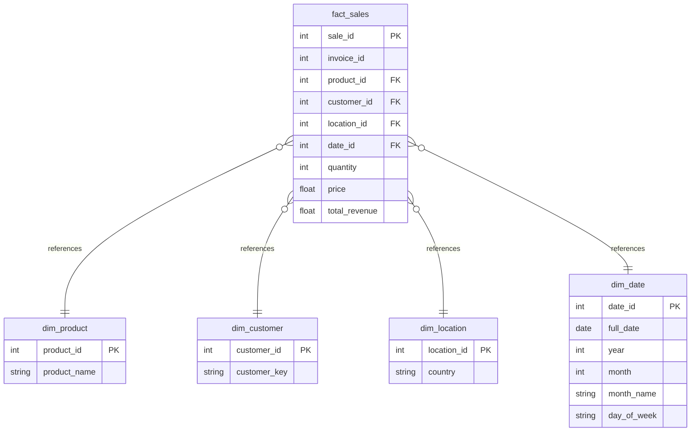

# Star Schema Data Model

## ERD Diagram

## Table Descriptions
1. **dim_product**: Contains unique products parsed from raw data.
2. **dim_customer**: Links surrogate customer_id to raw source customer_key.
3. **dim_location**: Maps country strings to surrogate location_id.
4. **dim_date**: A complete date dimension for the year 2023 with rich date attributes.
5. **fact_sales**: Transactional data storing quantities and revenues matched to dimension keys.
